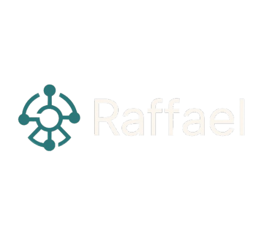

# Raffael: agentic intelligence for personal finance

`Raffael` is an intelligent, agentic AI system designed to help users make complex financial decisions with clarity and confidence. Built during the 3-day SwissHacks 2024 for Raiffeisen Switzerland, `Raffael` transforms static banking interfaces into personalised, proactive financial experiences.

---

## How it works

`Raffael` uses AI agents, real-time user profiling, and contextual orchestration to:

- Analyse user behaviour and financial data
- Recommend relevant financial products (e.g., mortgages, investments, pensions)
- Surface options users may not have known existed
- Automate advisory workflows with adaptive logic
- Integrate seamlessly with existing banking platforms via APIs

---

## 💡 Key features

- 🧭 **Agentic AI workflows** — Each user gets a personalised decision path, triggered dynamically based on their needs and context.
- ⚙️ **n8n integration** — Enables real-time orchestration of financial logic and prompt flows with modular, low-code scalability.
- 🔍 **Context-aware recommendations** — Suggests optimal products like Portfolio Management Mandates, Pillar 3a accounts, and Fund Savings Plans, based on their portfolio and risk profiles.
- 💬 **Conversational UI** — Human-centric chat interface that feels intuitive but operates on deep logic.

---

## 🔧 Tech stack

- **Frontend**: HTML/CSS
- **AI Layer**: OpenAI GPT + custom agents
- **Automation**: n8n (event-driven orchestration)  
- **Backend**: Node.js (API endpoints)  
- **Storage**: Local (due to prototype stage)

---

## 🌐 Example 

1. User interacts via a chat interface embedded in a banking portal.
2. Data is analysed (spending, goals, behavioural patterns).
3. An agentic workflow is triggered based on real-time needs.
4. The user receives actionable recommendations (e.g., switch to Fund Savings Plan).
5. Interactions are logged and looped back for continuous learning.

---

## 🧩 Use Cases

- Helping users discover better mortgage or savings options
- Recommending investments based on historical profiles
- Nudging users toward retirement planning (e.g., Pillar 3a)
- Reducing friction in understanding Raiffeisen’s full product suite

---

## 📍 Team

- [Shohail Ismail](https://github.com/Shohail-Ismail)
- [James Alger](https://github.com/JamesCAlger)
- [Abhiroop Basak](https://github.com/abhiroopbasak-tech)
- [Simone Panico](https://github.com/simone-panico)

---

## 📌 What’s Next

- Expand to multi-agent coordination for complex workflows such as executing optimal financial decisions as well as finding them
- API endpoint for direct Raiffeisen integration  
- Closed alpha with student and young professional test users  
- Enhance explainability layer for product recommendations

---

> `Raffael` : **the CFO in your pocket**
